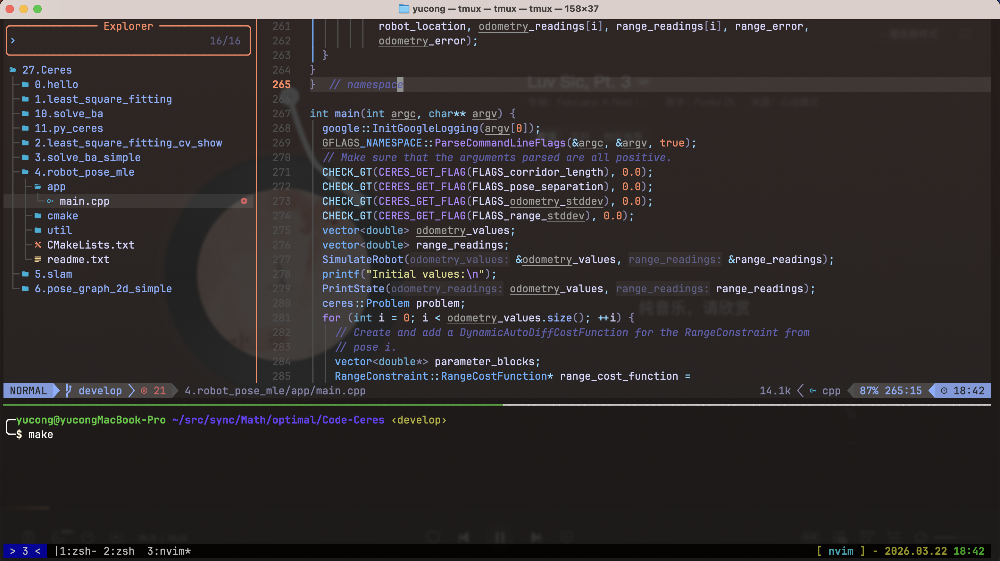
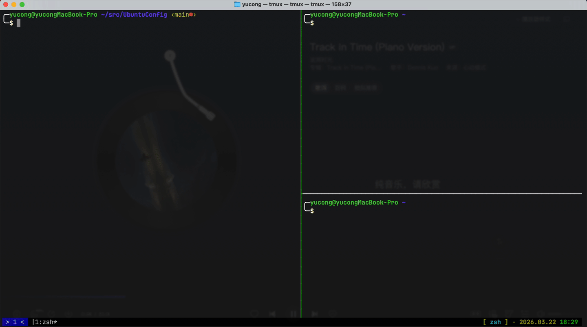
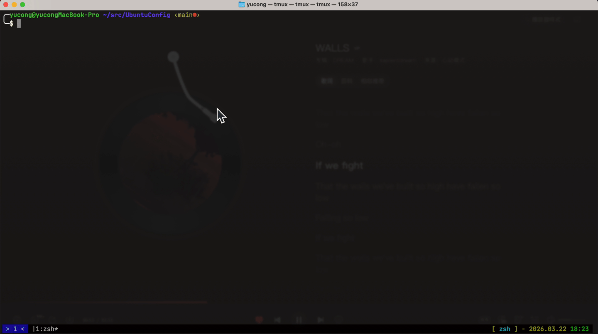
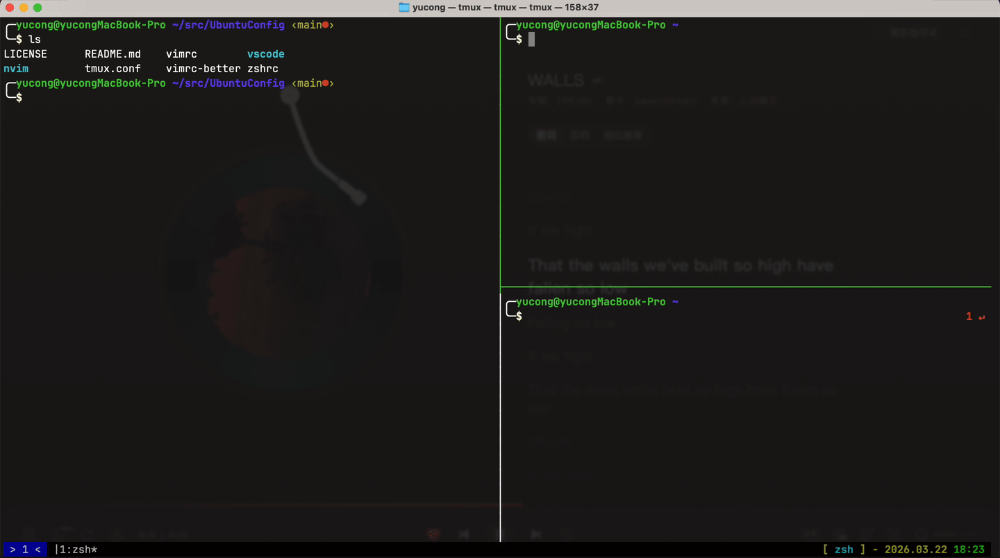

# UbuntuConfig

**UbuntuConfig** is a personal dotfiles repo for shell, terminal multiplexer, editors, and IDE settings—easy to sync across Linux and macOS without a heavy framework.

Neovim is configured on top of [LazyVim](https://github.com/LazyVim/LazyVim), powered by [lazy.nvim](https://github.com/folke/lazy.nvim), so you get sensible defaults plus room to extend. Other pieces are plain Vim, Zsh, and Tmux configs you can drop in or symlink as you like.

## ✨ What’s included

- 🐚 **Zsh** — [Oh My Zsh](https://ohmyz.sh/)–based `zshrc` (theme, plugins, PATH)
- 🪟 **Tmux** — prefix, splits, history, and workflow tweaks in `tmux.conf` (see [demos below](#tmux-demos))
- ✏️ **Vim** — classic `vimrc` + alternate `vimrc-better`
- 🚀 **Neovim** — LazyVim-style layout under `nvim/` (see [`nvim/README.md`](nvim/README.md))
- 🧩 **VS Code / Cursor** — `settings.json` and `keybindings.json`, plus a small script for macOS keymaps

## ⚡️ Requirements

- **Git** — to clone this repo
- **Zsh, [Oh My Zsh](https://ohmyz.sh/)** — if you use the bundled `zshrc`
- **Tmux**
- **Neovim** — LazyVim expects Neovim **≥ 0.11.2** (built with **LuaJIT**); see [LazyVim requirements](https://lazyvim.github.io/installation)

## 📂 File structure

Configs load from their usual locations once symlinked; you do not need a custom loader for shell/tmux/vim.

```text
UbuntuConfig/
├── LICENSE
├── README.md
├── zshrc
├── tmux.conf
├── vimrc
├── nvim/
│   ├── init.lua
│   ├── lua/
│   │   ├── config/      # options, keymaps, autocmds, lazy bootstrap
│   │   └── plugins/     # plugin specs (lazy.nvim)
│   └── README.md
└── vscode/
    ├── settings.json
    ├── keybindings.json
    └── keybindings-mac.json
```

## VS Code demos

**VSCode using Neovim**


## Tmux demos

**Neovim in Tmux**



**Add windows**



**Split panes**



**Switch windows**


**Resize panes**




---

## 🚀 Getting Started

Clone the repository (or fork it and use your own remote):

```sh
git clone <your-fork-or-repo-url>
cd UbuntuConfig
```

Back up any existing files you are about to replace, then symlink or copy configs. Examples:

```bash
# Tmux
ln -sf "./tmux.conf" ~/.tmux.conf

# Zsh
ln -sf "./zshrc" ~/.zshrc

# Vim
ln -sf "./vimrc" ~/.vimrc

# Neovim
ln -sf "./nvim" ~/.config/nvim

# VSCode
# Ubuntu
ln -sf "./vscode/settings.json" ~/.config/Code/User/settings.json
ln -sf "./vscode/keybindings.json" ~/.config/Code/User/keybindings.json
# macOS
ln -sf "./vscode/settings.json" ~/Library/Application\ Support/Code/User/settings.json
ln -sf "./vscode/keybindings-mac.json" ~/Library/Application\ Support/Code/User/keybindings.json
```

Start Neovim and let LazyVim bootstrap plugins:

```sh
nvim
```

Refer to comments in each file and to [LazyVim docs](https://lazyvim.github.io) for customization.

## ⚙️ Neovim

This repo’s Neovim setup follows LazyVim conventions: add or override plugin specs under `nvim/lua/plugins/`, and editor options under `nvim/lua/config/`. Full documentation lives at [lazyvim.github.io](https://lazyvim.github.io).

## 🧩 VS Code

- **Linux-oriented** shortcuts live in `vscode/keybindings.json` (`ctrl` / `alt`).
- On **macOS**, generate a mac-friendly file:

  ```sh
  python3 vscode/convert_keybindings_mac.py
  ```

  This writes `vscode/keybindings-mac.json` (maps `ctrl` → `cmd`, `alt` → `option`). Merge or copy into your editor’s keybindings JSON as needed.

---

## License

Apache License 2.0 — see [`LICENSE`](LICENSE).
